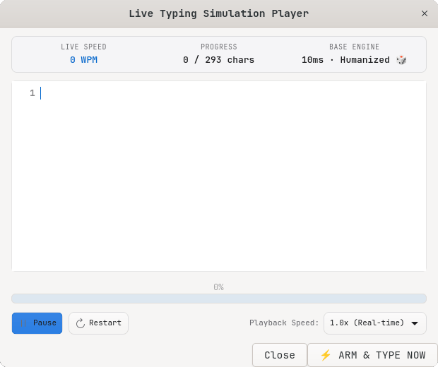
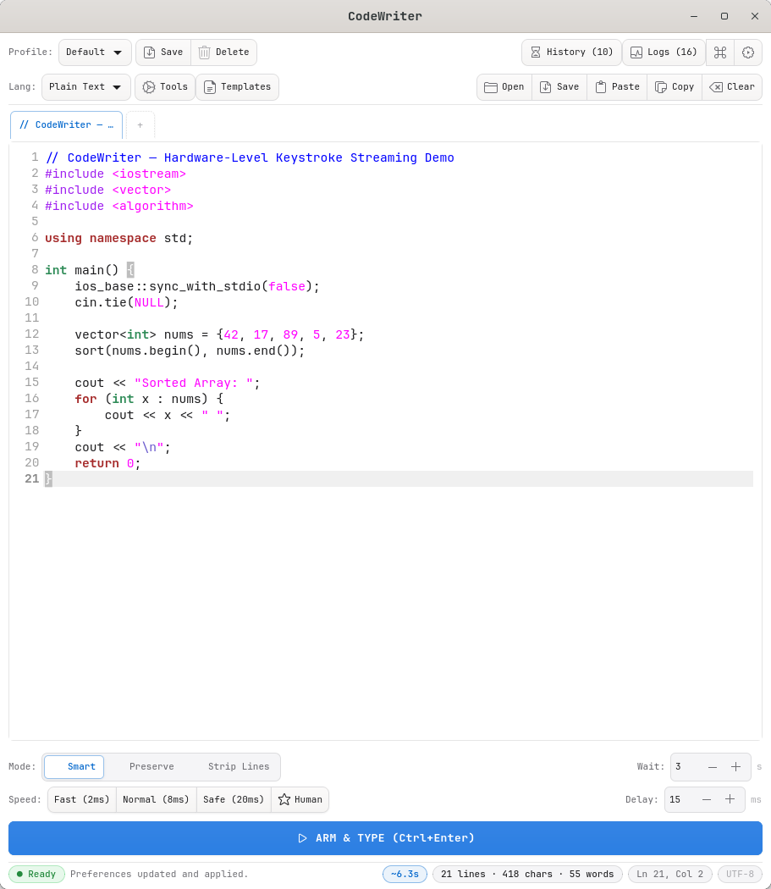
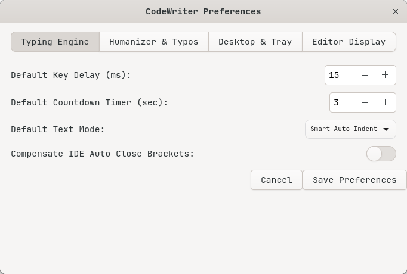
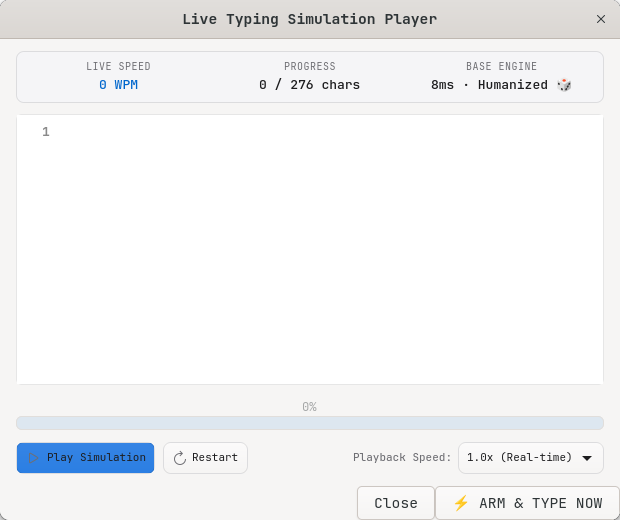
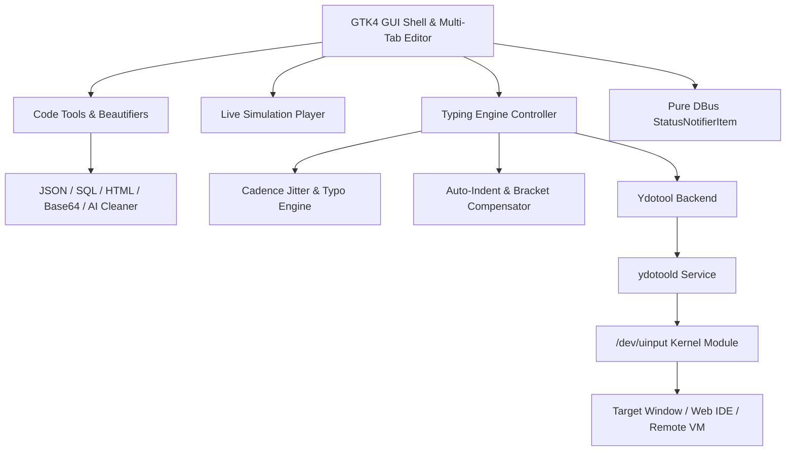

<div align="center">


# CodeWriter ⚡

### *Next-Generation Native Linux Keystroke Automation, Stealth Cadence & Code Beautification Utility*

[-0066cc?style=for-the-badge&logo=linux&logoColor=white)](https://github.com/ScaraMouche-Wanderer/CodeWriter)
[](https://github.com/ScaraMouche-Wanderer/CodeWriter)
[](https://github.com/ScaraMouche-Wanderer/CodeWriter)
[-34c759?style=for-the-badge&logo=pytest&logoColor=white)](https://github.com/ScaraMouche-Wanderer/CodeWriter)

[](LICENSE)

<br/>

<p align="center">
  <a href="#-quick-start"><strong>⚡ Quick Start</strong></a> •
  <a href="#-why-codewriter">Why CodeWriter?</a> •
  <a href="#-key-features">Key Features</a> •
  <a href="#-live-simulation-player">Live Visualizer</a> •
  <a href="#-code-tools--beautifiers">Code Tools</a> •
  <a href="#-keyboard-shortcuts">Shortcuts</a> •
  <a href="#-architecture">Architecture</a> •
  <a href="#-comparison">Comparison</a> •
  <a href="#-installation--dependencies">Installation</a>
</p>

<br/>

<p align="center">
  
</p>

---

## 🎯 Why CodeWriter?

> [!IMPORTANT]
> ### 🛑 Clipboard & Paste Restrictions Blocking Your Workflow?
> When working inside **locked remote desktops** *(Citrix, VMware Horizon, RDP)*, **VM web consoles** *(AWS Cloud9, Proxmox, vSphere, Guacamole)*, **online coding environments** *(LeetCode, HackerRank)*, or **proctored coding assessments**, standard clipboard paste (`Ctrl+V`) is frequently intercepted, blocked, or flagged.
> 
> ⚡ **The Hardware-Level Solution:**  
> **CodeWriter** bypasses all software clipboard monitors by transmitting staged code payloads directly through the Linux kernel input subsystem (`/dev/uinput`) via `ydotool`. To the OS and target window, every character arrives as genuine hardware keystrokes from a physical keyboard.

---


## ⚡ Quick Start

Get up and running in under **30 seconds**:

```bash
# 1. Clone the repository
git clone https://github.com/ScaraMouche-Wanderer/CodeWriter.git
cd CodeWriter

# 2. Run the desktop installer (registers icons, launcher & desktop integration)
./scripts/install.sh

# 3. Launch CodeWriter
python3 app.py
```

```text
 ┌────────────────┐      Ctrl+Enter      ┌─────────────────┐      3... 2... 1...     ┌───────────────────────┐
 │ 1. Stage Code  │ ───────────────────> │ 2. Arm & Switch │ ──────────────────────> │ 3. Hardware Streaming │
 │  Paste/Format  │                      │    Target Win   │                         │  Types at Your Cursor │
 └────────────────┘                      └─────────────────┘                         └───────────────────────┘
```

---

## 📸 Interface Showcase

| 📝 Multi-Tab Code Editor & Formatter | ⚙️ 4-Tab Comprehensive Preferences |
|:---:|:---:|
|  |  |

| 🎬 Live Real-Time Simulation Visualizer | 🎛 Pure DBus StatusNotifierItem System Tray |
|:---:|:---:|
|  | <br/>*Native StatusNotifierItem with live status transitions* |

---


## 🚀 Key Features

### ⚡ Hardware-Level Keystroke Streaming
- **Zero Clipboard Dependency**: Emulates physical keyboard events through Linux `/dev/uinput` via `ydotool`.
- **Universal Target Support**: Works in any Wayland or X11 window, web browser, electron app, terminal, or remote desktop client.
- **Interactive Pause & Resume (`Space` / `Ctrl+Shift+P`)**: Freeze active keystroke streams instantly mid-session without aborting.

### 🎲 Stealth Humanizer & Organic Cadence
- **Natural Jitter Cadence (`🎲 Human`)**: Timing dynamically fluctuates ($\pm 25\%$) per keystroke to mirror genuine human neuromuscular rhythm.
- **Authentic Typo Simulation & Auto-Correction**: Occasionally makes realistic QWERTY neighbor keystroke errors, pauses (80–180ms) to "notice", executes backspaces, and retypes the correct character.
- **Cognitive Syntax Thought Pauses**: Automatically injects natural deliberation pauses on newlines ($40-100\text{ms}$) and structural delimiters (`{`, `}`, `;`, `:`).
- **Speed Precision**: 1-click presets for **Fast** (2ms), **Normal** (8ms), **Safe** (20ms), or custom millisecond sliders ($1-1000\text{ms}$).

### 🎬 Live Simulation Player & Visualizer (`Ctrl+Shift+P`)
- **Real-Time Animated Preview**: Preview keystrokes rendered in real-time before sending them to the target window.
- **Speed Multipliers**: `0.5x` (Slow), `1.0x` (Real-time), `2.0x` (Fast), `5.0x` (Blitz), `10.0x` (Instant).
- **Telemetry Gauge**: Live WPM counter, character progression meters, and instant `⚡ ARM & TYPE NOW` trigger.

### 🛠 Code Formatters, Beautifiers & Encoders (`Ctrl+Shift+F`)
- **Auto-Format Code (`Ctrl+Shift+F`)**: Smart language detection applying proper formatters automatically.
- **JSON Formatter & Minifier**: Pretty-prints formatted JSON with indentation or compresses into single-line payload.
- **SQL Query Beautifier**: Capitalizes SQL keywords (`SELECT`, `FROM`, `WHERE`, `JOIN`, `ORDER BY`, `LIMIT`) and formats clause indentations.
- **HTML / XML Formatter**: Rebuilds tag hierarchies with proper nesting and void tag handling.
- **Case Converters**: Convert variables instantly to `camelCase`, `snake_case`, `PascalCase`, or `CONSTANT_CASE`.
- **String Literals & Escaper**: Escapes and unescapes quotes, newlines, and tabs (`\"`, `\n`, `\t`, `\\`) for string literals.
- **Line Manipulations & Sorting**: Remove blank lines, deduplicate unique lines, and sort lines ascending (`A → Z`) or descending (`Z → A`).
- **Data Encoders**: Instant Base64 encode/decode and URL percent encode/decode.
- **AI Markdown Extractor (`Ctrl+M`)**: Automatically strips conversational text, headers, and ````language code fences from ChatGPT, Claude, Gemini, or DeepSeek pastes.
- **Stealth Cleaning**: Strip comments (`//`, `#`, `--`, `/* */`), docstrings, and compensate for online IDE bracket auto-closing.

### 📝 Multi-Tab Editor, Telemetry & Ergonomic Controls
- **Live Telemetry Pill Bar**: Real-time status badge (`🟢 READY` / `⚡ STREAMING` / `⏸ PAUSED`), line/char/word metrics, estimated typing transmission duration (`~2.4s`), cursor position (`Ln X, Col Y`), and encoding pill.
- **Multi-Tab Architecture**: Open up to 8 concurrent editor tabs with syntax highlighting for **22 programming languages**.
- **Font Zooming**: Live zoom in (`Ctrl++`), zoom out (`Ctrl+-`), and reset (`Ctrl+0`).
- **Line Manipulations**: Duplicate lines (`Ctrl+Shift+D`), delete lines (`Ctrl+Shift+K`), and move lines up/down (`Alt+Up` / `Alt+Down`).
- **Soft Word Wrap**: Toggle soft wrapping with `Alt+Z`.
- **Starter Templates**: Fast I/O algorithms and starter boilerplates for Python, C++, Java, Rust, Go, and Bash.


### 🎛 Desktop & Tray Integration
- **Pure DBus System Tray**: Zero GTK3 dependencies; registers `StatusNotifierItem` and `DBusMenu` directly over Session DBus.
- **Acoustic Audio Feedback**: Audible countdown clicks and dual-tone completion chime.
- **Desktop Notifications**: Summary toast with character volume, duration, and calculated WPM.

---

## ⌨️ Keyboard Shortcuts

| Category | Shortcut | Action |
|:---|:---|:---|
| **⚡ Streaming & Control** | `Ctrl + Enter` | **⚡ ARM & TYPE NOW** |
| | `Space` | **Pause / Resume** typing stream |
| | `Escape` | **Stop / Cancel** typing countdown or stream |
| | `Ctrl + P` | **Pre-Flight Dry Run Preview** |
| | `Ctrl + Shift + P` | **🎬 Live Simulation Player / Visualizer** |
| **🛠 Code Tools** | `Ctrl + Shift + F` | **Auto-Format Code** (JSON / SQL / HTML) |
| | `Ctrl + M` | **Extract Code from AI Markdown** |
| | `Ctrl + Shift + D` | **Duplicate Current Line / Selection** |
| | `Ctrl + Shift + K` | **Delete Current Line** |
| | `Alt + Up` / `Alt + Down` | **Move Current Line Up / Down** |
| | `Alt + Z` | **Toggle Soft Word Wrap** |
| | `Ctrl + +` / `Ctrl + -` / `Ctrl + 0` | **Font Zoom In / Zoom Out / Reset** |
| **📝 Editor & File** | `Ctrl + F` / `Ctrl + H` | **Find** / **Find & Replace** |
| | `Ctrl + O` / `Ctrl + S` | **Open File** / **Save File** |
| | `Ctrl + L` | **Clear Editor Buffer** |
| **⚙️ Application** | `Ctrl + ,` | **⚙️ CodeWriter Preferences Modal** |
| | `Ctrl + 1` / `Ctrl + 2` / `Ctrl + 3` | **Speed Presets**: Fast (2ms) / Normal (8ms) / Safe (20ms) |
| | `Ctrl + ?` | **Keyboard Shortcuts Cheat Sheet** |

---

## 🏗 Architecture

CodeWriter is built with a modular, decoupled architecture:




---

## 📊 Comparison

| Feature | CodeWriter | Clipboard Paste (`Ctrl+V`) | Basic Auto-Typers |
|:---|:---:|:---:|:---:|
| **Bypasses Paste Restrictions** | ✅ **Yes (Hardware)** | ❌ Blocked | ⚠️ Limited |
| **Wayland & X11 Native** | ✅ **Yes (Full)** | ⚠️ Depends | ❌ X11 Only |
| **Human-Like Cadence Jitter** | ✅ **Yes ($\pm 25\%$)** | ❌ None | ❌ Fixed Delays |
| **Typo & Auto-Correction Simulation** | ✅ **Yes (Authentic)** | ❌ None | ❌ None |
| **Live Visualizer & WPM Gauge** | ✅ **Yes (`Ctrl+Shift+P`)** | ❌ None | ❌ None |
| **Code Beautifiers & AI Cleaner** | ✅ **Yes (JSON/SQL/HTML)** | ❌ None | ❌ None |
| **Multi-Tab Editor & Line Tools** | ✅ **Yes (GtkSourceView 5)** | ❌ None | ❌ None |
| **Pure DBus System Tray** | ✅ **Yes (GTK4 Safe)** | ❌ None | ⚠️ GTK3 / Fallback |

---

## 📦 Installation & Dependencies

### 1. Install System Packages

```bash
# Debian / Ubuntu / Pop!_OS
sudo apt update && sudo apt install -y python3-gi gir1.2-gtk-4.0 gir1.2-gtksource-5 ydotool librsvg2-bin

# Arch Linux / Manjaro
sudo pacman -S --needed python-gobject gtk4 gtksourceview5 ydotool librsvg

# Fedora / RHEL
sudo dnf install -y python3-gobject gtk4 gtksourceview5 ydotool librsvg2-tools
```

### 2. Enable Keystroke Daemon

```bash
systemctl --user enable --now ydotool.service || sudo systemctl enable --now ydotool.service
```

### 3. User Permissions (Optional fallback)

If running without the systemd service:
```bash
sudo usermod -aG input $USER
```

---

## 🧪 Test Suite

Run the full automated test suite (98 tests across typing engine, formatters, humanizer, settings, and tray DBus interfaces):

```bash
python3 -m pytest tests/ -v
```

```text
======================= 98 passed, 24 warnings in 1.04s ========================
```

---

## 📄 License

Distributed under the **MIT License**. See [`LICENSE`](LICENSE) for complete details.

---

<div align="center">
  <sub>Built with ❤️ for the Linux developer community by <a href="https://github.com/ScaraMouche-Wanderer">ScaraMouche-Wanderer</a>.</sub>
</div>
