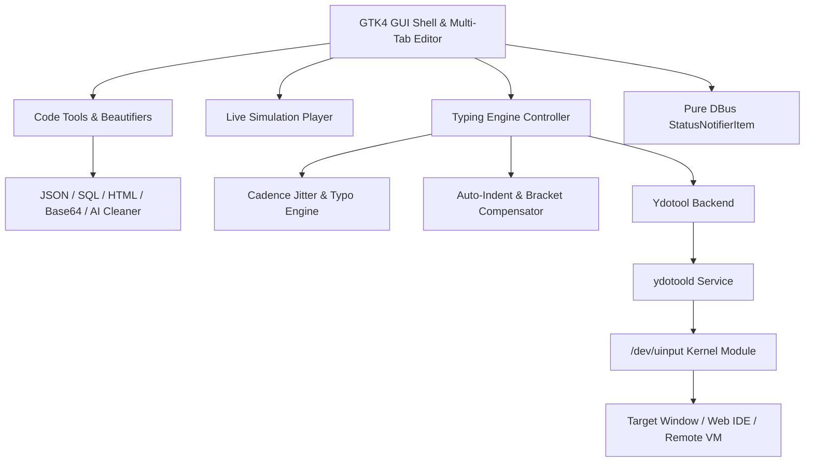

<div align="center">


# CodeWriter ⚡

### *Next-Generation Native Linux Keystroke Automation, Stealth Cadence & Code Beautification Utility*

[-0066cc?style=for-the-badge&logo=linux&logoColor=white)](https://github.com/ScaraMouche-Wanderer/CodeWriter)
[](https://github.com/ScaraMouche-Wanderer/CodeWriter)
[](https://github.com/ScaraMouche-Wanderer/CodeWriter)
[-34c759?style=for-the-badge&logo=pytest&logoColor=white)](https://github.com/ScaraMouche-Wanderer/CodeWriter)
[](LICENSE)

<br/>

<p align="center">
  <a href="#-why-codewriter"><strong>Why CodeWriter?</strong></a> •
  <a href="#-quick-start--step-by-step-guide"><strong>Step-by-Step Guide</strong></a> •
  <a href="#-key-features"><strong>Key Features</strong></a> •
  <a href="#-code-tools--beautifiers"><strong>Code Tools</strong></a> •
  <a href="#-keyboard-shortcuts"><strong>Shortcuts</strong></a> •
  <a href="#-installation--setup"><strong>Installation</strong></a>
</p>

<br/>


</div>

---

## 🎯 Why CodeWriter?

> [!IMPORTANT]
> ### 🛑 Clipboard & Paste Restrictions Blocking Your Workflow?
> When working inside **locked remote desktops** *(Citrix, VMware Horizon, RDP)*, **VM web consoles** *(AWS Cloud9, Proxmox, vSphere, Guacamole)*, **online coding environments** *(LeetCode, HackerRank)*, or **proctored coding assessments**, standard clipboard paste (`Ctrl+V`) is frequently intercepted, blocked, or flagged.
> 
> ⚡ **The Hardware-Level Solution:**  
> **CodeWriter** bypasses all software clipboard monitors by transmitting staged code payloads directly through the Linux kernel input subsystem (`/dev/uinput`) via `ydotool`. To the OS and target window, every character arrives as genuine hardware keystrokes from a physical keyboard.

---

## ⚡ Quick Start & Step-by-Step Guide

Follow this simple workflow to stream code into any application in under **30 seconds**:

```text
 ┌──────────────────────┐      Ctrl+Enter      ┌──────────────────────┐      3... 2... 1...     ┌────────────────────────┐
 │ 1. Stage & Clean     │ ───────────────────> │ 2. Arm & Switch      │ ──────────────────────> │ 3. Hardware Streaming  │
 │  Paste / Format Code │                      │    Focus Target Win  │                         │  Types at Active Cursor│
 └──────────────────────┘                      └──────────────────────┘                         └────────────────────────┘
```

### 1️⃣ Installation & Launch
```bash
# Clone the repository
git clone https://github.com/ScaraMouche-Wanderer/CodeWriter.git
cd CodeWriter

# Run the installer (sets up icons, launcher & permissions)
./scripts/install.sh

# Launch CodeWriter
python3 app.py
```

### 2️⃣ Step-by-Step Usage

| Step | Action | Description |
|:---|:---|:---|
| **Step 1** | **Stage Your Code** | Paste or type code into the editor. You can also drag & drop files or load built-in templates (`Python`, `C++`, `Java`, `Rust`). |
| **Step 2** | **Clean & Format** | Click **Tools** or press `Ctrl+M` to auto-extract code from AI responses (ChatGPT, Claude, Gemini) and strip conversational markdown fences. |
| **Step 3** | **Select Speed Preset** | Choose your typing speed: **Fast** (`2ms`), **Normal** (`8ms`), or **Safe** (`20ms`). Toggle `🎲 Human` for natural typing cadence. |
| **Step 4** | **Arm & Focus** | Press `Ctrl + Enter` (or click **ARM & TYPE**). A 3-second countdown begins—simply click into your target window or editor. |
| **Step 5** | **Live Control** | Watch CodeWriter type directly into the target field. Press `Space` to **Pause/Resume** or `Escape` to **Stop**. |

---

## 📸 Interface Showcase

| 📝 Multi-Tab Code Editor & Formatter | ⚙️ 4-Tab Comprehensive Preferences |
|:---:|:---:|
|  |  |

| 🎬 Live Real-Time Simulation Visualizer | 🎛 Pure DBus StatusNotifierItem System Tray |
|:---:|:---:|
|  | <br/>*Native StatusNotifierItem with live status transitions* |

---

## 🚀 Key Features

### ⚡ Hardware-Level Keystroke Streaming
- **Zero Clipboard Dependency**: Emulates genuine USB keyboard events through Linux `/dev/uinput` via `ydotool`.
- **Universal Compatibility**: Works across all Wayland & X11 windows, browsers, Electron apps, terminals, and remote desktop clients.
- **Interactive Live Control**: Pause and resume typing on the fly (`Space`) or abort anytime (`Esc`).

### 🎲 Stealth Humanizer & Natural Cadence
- **Human Jitter Cadence**: Dynamically varies delay ($\pm 25\%$) per stroke to simulate realistic human neuromuscular rhythm.
- **Authentic Typo Simulation**: Occasionally mistypes QWERTY neighbor keys, pauses (80–180ms), hits backspace, and fixes the character.
- **Cognitive Syntax Pauses**: Injects natural thinking pauses at newlines ($40-100\text{ms}$) and punctuation (`{`, `}`, `;`, `:`).
- **Speed Presets**: Instant switching between **Fast** (2ms), **Normal** (8ms), **Safe** (20ms), or custom millisecond sliders.

### 🎬 Live Simulation Player & Visualizer (`Ctrl+Shift+P`)
- **Pre-Flight Playback**: Watch an animated typing simulation in an isolated sandbox window before sending keystrokes.
- **Speed Multipliers**: Test playback at `0.5x`, `1.0x`, `2.0x`, `5.0x`, or `10.0x`.
- **Live Telemetry Meter**: Displays real-time Words Per Minute (WPM), progress percentage, and character metrics.

### 🛠 Code Tools, Formatters & Encoders (`Ctrl+Shift+F`)
- **AI Markdown Extractor (`Ctrl+M`)**: Automatically strips conversational text and code fences from ChatGPT, Claude, and Gemini pastes.
- **Auto-Formatters**: Built-in formatters for **JSON** (pretty & minify), **SQL queries**, and **HTML/XML**.
- **Case Converters**: One-click convert identifiers to `camelCase`, `snake_case`, `PascalCase`, or `CONSTANT_CASE`.
- **String Literals & Escaper**: Escape and unescape quotes, newlines, and tabs (`\"`, `\n`, `\t`, `\\`) for string literals.
- **Line Tools & Sorting**: Remove blank lines, deduplicate unique lines, and sort alphabetically (`A → Z` / `Z → A`).
- **Data Encoders**: Instant Base64 encode/decode and URL percent encode/decode.
- **Comment Stripper**: Clean single-line (`//`, `#`, `--`) and multi-line block comments for clean submissions.

### 📝 Multi-Tab Editor & Ergonomic Controls
- **Live Telemetry Bar**: Real-time status pill (`🟢 READY` / `⚡ STREAMING` / `⏸ PAUSED`), line/char/word metrics, estimated duration (`~2.4s`), and cursor position (`Ln X, Col Y`).
- **Multi-Tab Architecture**: Work with up to 8 concurrent editor tabs with syntax highlighting for **22 programming languages**.
- **Editor Ergonomics**: Font zooming (`Ctrl++` / `Ctrl+-` / `Ctrl+0`), line duplication (`Ctrl+Shift+D`), line deletion (`Ctrl+Shift+K`), and line moving (`Alt+Up` / `Alt+Down`).
- **Starter Templates**: Fast I/O algorithms and templates for Python, C++, Java, Rust, Go, and Bash.

---

## ⌨️ Keyboard Shortcuts

| Category | Shortcut | Action |
|:---|:---|:---|
| **⚡ Streaming & Control** | `Ctrl + Enter` | **⚡ ARM & TYPE NOW** |
| | `Space` | **Pause / Resume** typing stream |
| | `Escape` | **Stop / Cancel** typing countdown or stream |
| | `Ctrl + P` | **Pre-Flight Dry Run Preview** |
| | `Ctrl + Shift + P` | **🎬 Live Simulation Player / Visualizer** |
| **🛠 Code Tools** | `Ctrl + Shift + F` | **Auto-Format Code** (JSON / SQL / HTML) |
| | `Ctrl + M` | **Extract Code from AI Markdown** |
| | `Ctrl + Shift + D` | **Duplicate Current Line / Selection** |
| | `Ctrl + Shift + K` | **Delete Current Line** |
| | `Alt + Up` / `Alt + Down` | **Move Current Line Up / Down** |
| | `Alt + Z` | **Toggle Soft Word Wrap** |
| | `Ctrl + +` / `Ctrl + -` / `Ctrl + 0` | **Font Zoom In / Zoom Out / Reset** |
| **📝 Editor & File** | `Ctrl + F` / `Ctrl + H` | **Find** / **Find & Replace** |
| | `Ctrl + O` / `Ctrl + S` | **Open File** / **Save File** |
| | `Ctrl + L` | **Clear Editor Buffer** |
| **⚙️ Application** | `Ctrl + ,` | **⚙️ CodeWriter Preferences Modal** |
| | `Ctrl + 1` / `Ctrl + 2` / `Ctrl + 3` | **Speed Presets**: Fast (2ms) / Normal (8ms) / Safe (20ms) |
| | `Ctrl + ?` | **Keyboard Shortcuts Cheat Sheet** |

---

## 🏗 Architecture



---

## 📊 Comparison

| Feature | CodeWriter | Clipboard Paste (`Ctrl+V`) | Basic Auto-Typers |
|:---|:---:|:---:|:---:|
| **Bypasses Paste Restrictions** | ✅ **Yes (Hardware-level)** | ❌ Blocked | ⚠️ Limited |
| **Wayland & X11 Native** | ✅ **Yes (Full)** | ⚠️ Depends | ❌ X11 Only |
| **Human-Like Cadence Jitter** | ✅ **Yes ($\pm 25\%$)** | ❌ None | ❌ Fixed Delays |
| **Typo & Auto-Correction Simulation** | ✅ **Yes (Authentic)** | ❌ None | ❌ None |
| **Live Visualizer & WPM Gauge** | ✅ **Yes (`Ctrl+Shift+P`)** | ❌ None | ❌ None |
| **Code Beautifiers & AI Cleaner** | ✅ **Yes (JSON/SQL/HTML)** | ❌ None | ❌ None |
| **Multi-Tab Editor & Line Tools** | ✅ **Yes (GtkSourceView 5)** | ❌ None | ❌ None |
| **Pure DBus System Tray** | ✅ **Yes (GTK4 Safe)** | ❌ None | ⚠️ GTK3 / Fallback |

---

## 📦 Installation & Setup

### 1. Install Dependencies

```bash
# Debian / Ubuntu / Pop!_OS / Linux Mint
sudo apt update && sudo apt install -y python3-gi gir1.2-gtk-4.0 gir1.2-gtksource-5 ydotool librsvg2-bin

# Arch Linux / Manjaro
sudo pacman -S --needed python-gobject gtk4 gtksourceview5 ydotool librsvg

# Fedora / RHEL
sudo dnf install -y python3-gobject gtk4 gtksourceview5 ydotool librsvg2-tools
```

### 2. Enable Keystroke Daemon

```bash
systemctl --user enable --now ydotool.service || sudo systemctl enable --now ydotool.service
```

### 3. Run Desktop Installer

```bash
./scripts/install.sh
```

---

## 🧪 Test Suite

CodeWriter includes a comprehensive automated test suite covering all modules:

```bash
python3 -m pytest tests/ -v
```

```text
======================= 101 passed, 25 warnings in 1.04s =======================
```

---

## 📄 License

Distributed under the **MIT License**. See [`LICENSE`](LICENSE) for complete details.

---

<div align="center">
  <sub>Built with ❤️ for the Linux developer community by <a href="https://github.com/ScaraMouche-Wanderer">ScaraMouche-Wanderer</a>.</sub>
</div>
